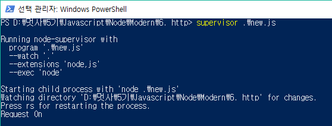

## **Server 객체**

#### Method
* listen(port, callback) : 서버 실행    
* close(callback) : 서버 종료   

```
모듈 호출 및 서버 생성
var http = require('http');
var server = http.createServer();

서버 실행
server.listen(52273, fucntion() {
  console.log('Server Runnning at http://127.0.0.1:52273');
  });

서버 종료
server.close();
```

<br>    

#### event
* request : 클라이언트 요청 시 발생
* connection : 클라이언트 접속 시 발생
* close : 서버 종료
* checkContinue : 클라이언트가 지속적으로 연결하고 있을 때 발생
* upgrade : 클라이언트가 http 업그레이드를 요청할 때 발생
* clientError : 클라이언트에서 오류가 발생할 때 이벤트


```
// 모듈 호출 및 서버 생성
var http = require('http');
var server = http.createServer();

// Request 이벤트 연결
server.on('request', function(code) {
  console.log('Request On');
  });

// Connection 이벤트 연결
server.on('connction', function(code) {
  console.log('connection on');
  });

// Close 이벤트 연결
server.on('close', function(code) {
  console.log('close on');
  });

// 서버 실행
server.listen(52273);
```
    


**request 파라미터는 createServer() 메소드의 매개변수로 사용할 수 있다. **    
```
  require('http').createServer(function (request, response) {
    console.log('Server on');
  });
```

<br>

## **response**

#### Method
* writeHead(statusCode, StatusMessage, headers) : 헤더 작성
* end(data, encoding, callback) : 본문 작성
* readFile('파일이름', callback) : File에서 읽어오기

```

var fs = require('fs');
var http = require('http');

// 서버 생성 및 실행
http.createServer(function(request, response) {

  // HTML파일 읽어오기
  fs.readFile('HTMLPage2.html', function(error, data) {
    response.writeHead(200, { 'content-type' : 'text/html' });
    response.end(data);
    });
  }).listen(52273, function() {
    console.log('Server Runnning at http://127.0.0.1:52273');
    });
```


** MIME Type이란? **    
클라이언트에게 전송될 파일의 type을 명시해주는 것   

구조    
<code>part/subpart</code>

[MIME type](https://developer.mozilla.org/ko/docs/Web/HTTP/Basics_of_HTTP/MIME_types)

```
~~~
  fs.readFile('htmlpage.html', fucntion(error, data) {
    // 소리 파일
    response.writeHead(200, {'content-type' : 'audio/mp3'});
    // 비디오 파일
    response.writeHead(200, {'content-type' : 'video/mp4'});
    // 이미지 파일
    response.writeHead(200, {'content-type' : 'image/jpeg'});
    response.end(data);
    });
~~~
```

#### 쿠키
##### 속성 및 할당
Name = value의 형태로 배열의 원소처럼 나열하여 넣는다.   

Expires = 날짜;   
Domain = 도메인;   
Path = 경로;  
Location = 이동하고자 하는 주소;
```
~~~
http.createServer(function (request, response) {
  response.writeHead(200, {
    'content-type' : 'text/html',
    // 쿠키 입력
    'Set-Cookie' : ['breakfast = toast', 'dinner = chicken'],
    'Location' : 'http://www.hanbit.co.kr'
    });

    // 쿠키 출력
    response.end(request.headers.cookie);
  }).listen(52273, function() {
    console.log('Server Runnning at http://127.0.0.1:52273');
    });
~~~
```

#### Http 상태 code
Client의 Request에 따라 다른 형태를 띄게 되는데 이 값을 설정 할 수도 있다.    
자세한 내용은 링크 참조   
1xx : 처리중   
2xx : 성공    
3xx : redirect    
4xx : 클라이언트 오류    
5xx : 서버 오류   
**[http status code](https://ko.wikipedia.org/wiki/HTTP_%EC%83%81%ED%83%9C_%EC%BD%94%EB%93%9C)**

```
~~~
response.writeHead(404);
response.end();
~~~
```


## **request**

#### 속성
* method : 클라이언트의 요청방식
* url : 클라이언트의 요청 url
* headers : 요청 메시지 헤더
* trailers : 요청 메시지 트레일러
* httpVersion : HTTP프로토콜 버전   


** URL path로 페이지 구분**
```
~~~
// 변수 선언
var pathName = url.parse(request.url).pathName;

// 페이지 구분
if (pathName == '/'){
  // Index파일 읽기
  fs.readFile('Index.html', function(error, data) {
    response.writeHead(200, {'content-type' : 'text/html'});
    response.end(data);
  });
}
else if(pathName == '/OtherPage'){
  // OtherPage읽기
  fs.readFile('OtherPage.html', function(error, data) {
    response.writeHead(200, {'content-type' : 'text/html'});
    response.end(data);
  });
}
~~~
```

** method로 페이지 구분 **
```
~~~
if (request.method == 'GET') {
  console.log('GET 요청입니다.');
}
else if (request.method == 'POST') {
  console.log('POST 요청입니다.');
}
~~~
```

** GET 요청 추출 **   
```
// 요청 매개변수 출력
var query = url.parse(request.url, true).query;

// Get 매개변수 출력
response.writeHead(200, {'content-type' : 'text/html'});
response.end(JSON.stringify(query));
```
   

<code>JSON.stringify()</code> : JSON type을 문자열로 변환하여 출력    
<br>    

** POST 요청 추출 **
```
~~~
if (request.method == 'GET') {
  // GET 요청
  fs.readFile('HTMLPage2.html', function(error, data) {
    response.writeHead(200, { 'content-type' : 'text/html'});
    response.end(data);
  });
}
else if (request.method == 'POST') {
  // POST 요청
  request.on('data', function(data) {
    response.writeHead(200, {'content-type' : 'text/html'});
    response.end('<h1>'+data+'</h1>');
  });
}
~~~
```

#### Request 객체의 쿠키 추출
앞 절에서 나왔던 response객체에서의 쿠키 추출 방법과 같다.   
```
~~~
// Get cookie
var cookie = request.headers.cookie;

// Set cookie
response.writeHead(200, {
  'content-type' : 'text/html',
  'Set-Cookie' : ['name = RintIanTta', 'region = Seoul']
  });

response.end(JSON.stringify(cookie));
~~~
```

