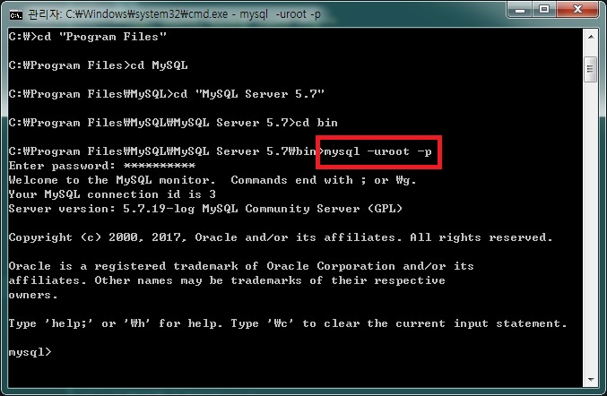
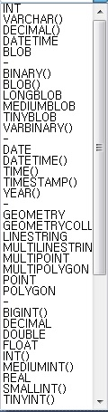
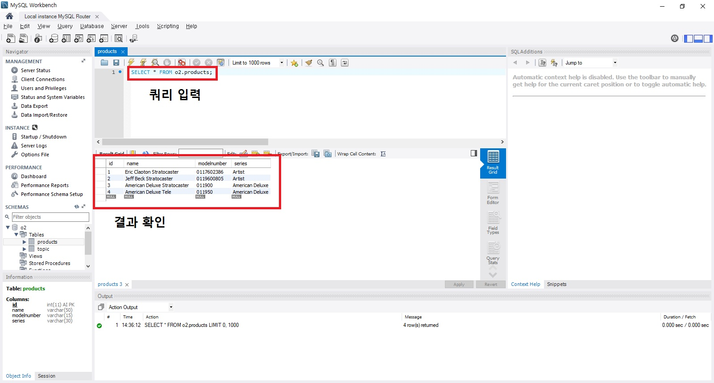
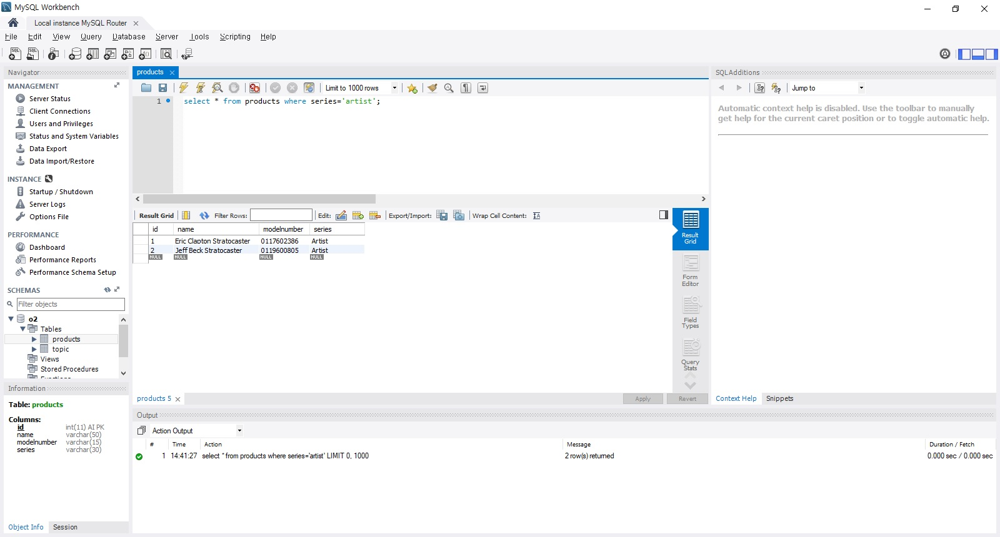
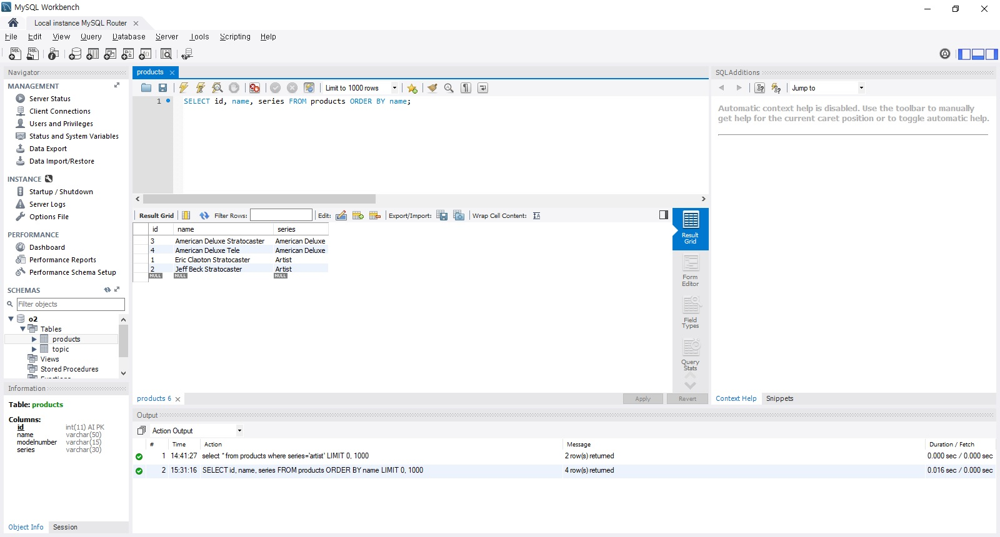
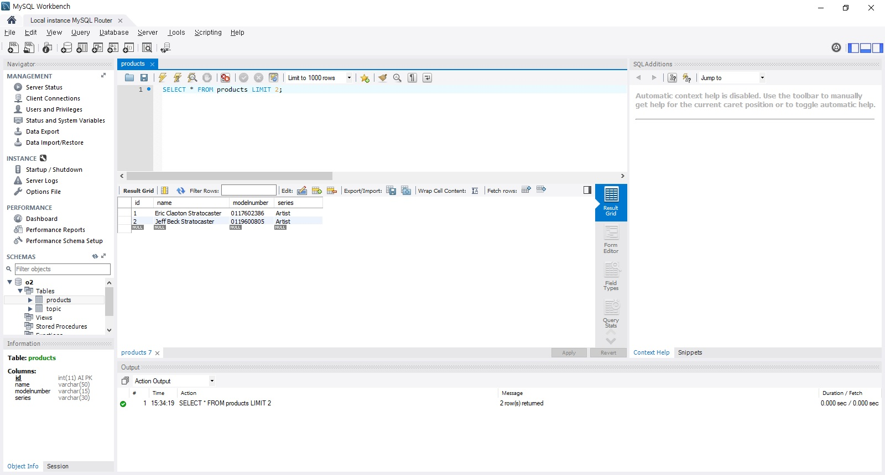
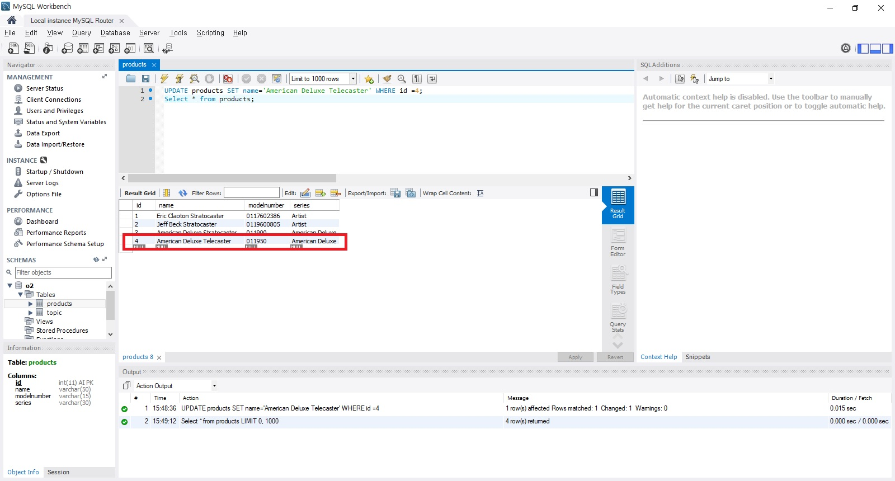

## 1. MySQL 설치
[다운로드](https://www.mysql.com/downloads/)
### 윈도우 설치
설치    
다운로드 링크에서 mysql installer 다운로드 후 MySQL Server 설치    
*나머지는 선택 사항*    

접속    
**cmd, shell, bash중 cmd만 가능**   
cmd에서 mysql server 설치 폴더로 이동 후    
<code>mysql -uroot -p</code> 입력 후 비밀번호 입력   



### 우분투 설치
설치    
<code>sudo apt-get install mysql-server mysql-client</code>   

접속    
<code>mysql -uroot -p</code>    


* -u : user   
* root : root(최고 권한 유저), default    
* -p : password   

### 맥 설치


## 2. 기본 명령어
**Database의 범위**    

| 범위 | MySQL |
|:-----:|:-------:|
| 도서관 | Database |
| 책 | table |
| 정보 | data |

즉 database > table > data이다.    

### DB 생성
<code>CREATE DATABASE DB이름</code>   
ex) <code>CREATE DATABASE O2</code>   

전체 DB 보기    
<code>SHOW DATABASES</code>   

DB 선택   
<code>USE DB이름</code>   
ex) <code>use O2</code>   

### table 생성
<code>CREATE TABLE table이름 (col과 속성 값)</code>   
ex)
```
CREATE TABLE products (
  id INT NOT NULL AUTO_INCREMENT PRIMARY KEY,
  name VARCHAR(50) NOT NULL,
  modulenumber VARCHAR(15) NOT NULL,
  series VARCHAR(30) NOT NULL
);
```

** 각 column의 속성 값 **    

| 속성 | 설명 |
|:----:|:----:|
| NOT NULL | 빈칸 불가 |
| AUTO_INCREMENT | 자동 증가 |
| PRIMARY KEY | 기본 값으로 설정  |
...   
    

**table의 정보 확인**    
<code>DESCRIBE table이름</code>   
ex)<code>DESC products;</code>


### 데이터 저장(삽입)
<code>INSERT into 테이블명 (col1, col2) VALUE (col1의 데이터, col2의 데이터)    
ex)   
```
INSERT INTO products (name, modelnumber, series) VALUES ('Eric Clapton Stratocaster', '0117602386', 'Artist');
```


### 데이터 조회
<code>SELECT col명 FROM 테이블명</code>   
ex)<code>SELECT * FROM products;</code>    



### 조건 검사
<code>select col명 FROM 테이블명 WHERE 조건</code>   
ex)<code>select * from products where series='Artist'</code>   



### 데이터 정렬
<code>SELECT * from 테이블명 **ORDER BY*** col명</code>   
ex)<code>SELECT id, name, series FROM products ORDER BY name;</code>    



### 특정 위치에 있는 데이터 선택
<code>SELECT * FROM 테이블명 **LIMIT 2***;</code>
ex) <code>SELECT * FROM products LIMIT 2;</code>    



### 데이터 수정
<code>UPDATE 테이블명 SET col명=값 WHERE 변경할row</code>    
ex) <code>UPDATE products SET name='American Deluxe Telecaster' WHERE id =4;</code>   


### 데이터 삭제
<code>DELETE FROM products WHERE 삭제할row명</code>   
ex)<code>DELETE FROM products WHERE id=10;</code>   
> **조건문으로 row를 설정하지 않으면 모든 데이터가 삭제되므로 주의**

#### table 삭제
<code>DROP TABLE 테이블명;</code>   

#### database 삭제
<code>DROP DATABASE DB명;</code>


## 3. MySQL 모듈

#### mysql의 메소드
<code>createConnection(options)</code> : DB접속
* options에 들어갈 객체의 속성
  * host : 호스트명
  * port : 포트명
  * user : mysql user이름
  * password : mysql user 비밀번호
  * database : 연결할 DB명
  * debug : 디버그모드 사용 유무

```
var mysql = require('mysql');

var client = mysql.createConnection({
  user : 'root',
  password : '비밀번호',
  database : o2
  });
```

#### Connection객체의 method    
<code>query(sql[callback])</code> : query 실행   

```
client.query('SELECT * FROM products', function(error, result, fields) {
    if(error) {
      console.log('query문장 오류');
    }
    else {
      console.log(result);
    }
  });
```

#### 토큰
데이터를 입력할 때 ?토큰을 사용하는데 이는 JS뿐만 아니라 DB를 사용하는 많은 framework에서 공통적으로 사용하는 방법이므로 알아두자   

```
client.query('INSERT INTO products (name, modelnumber, seires) VALUES (?, ?, ?)',
[request.params.name, request.params.modelnumber, request.params.series],
function(error, data, fields) {
  ~~~
  });
```

## 4. MySQl 모듈을 사용한 CRUD 구현
*사전 작업*   
<code>npm install express ejs mysql body-parser</code>   


### 데이터 표시
[list](list.html)   
### 데이터 삭제

### 데이터 추가
[insert](insert.html)   
### 데이터 수정

### **전체코드**
[app.js](app.js)    
[list](list.html)   
[insert](insert.html)   
[edit](edit.html)
