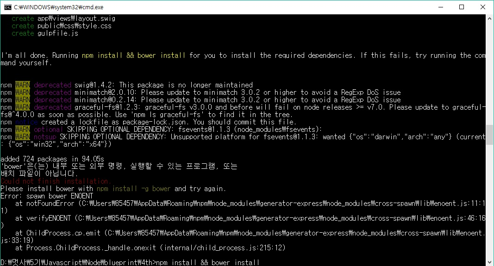

## Yeoman이란?
WebApp을 포괄적으로 구성하는 scaffolding tool이다.        

요맨 그 자체로는 단순히 CLI에 불과하며 yo-generator라는 모듈을 통해 사용할 수 있다.
```
    <!-- Angular 생성 -->
    yo generator-angular

    <!-- express 생성 -->
    yo generator-express

    <!-- Vue.js 생성 -->
    yo generator-Vuejs
```
> 참조        
[yoman](https://github.com/miconblog/Slide/tree/master/20140402)   
[yoman 구성도](https://www.slideshare.net/emotion987/yeoman-46019392)


## Bower(Web Package Manager)
Web FrontEnd 전용 패키지 매니저로 Twitter에서 개발되어 그 하단에서만 사용되었지만 규모가 커지면서 2012년 Twitter가 오픈소스로 공개하여 독자적으로 사용이 가능하다.
다만 이를 사용하기 위해서는 git과 NPM이 필요하다.

> 참조        
[Bower 홈페이지](https://bower.io/)      
[Bower 사용법](http://webframeworks.kr/getstarted/bower/)




## generator-express와 express-generator의 차이

* generator-express     
  Yeoman에서 express의 기본틀을 생성하는 모듈

* express-generator     
  express모듈의 하위 모듈로 express의 기본 틀을 생성해주는 모듈

> 참조        
[두 모듈의 차이점?](https://stackoverflow.com/questions/41311348/express-or-express-generator-do-i-need-both)


## Mongoose를 이용한 code refactoring

### cloudinary 제거

### jugglingdb to Mongoose
