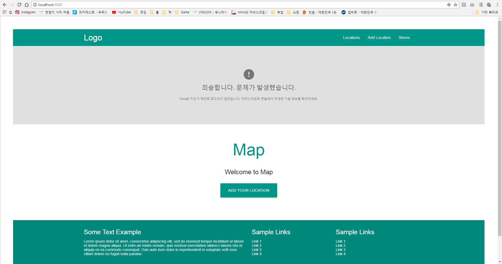
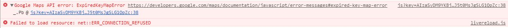

### 구글 지도 API key 얻기
[Google Maps API](https://developers.google.com/maps/documentation/?hl=ko)페이지에서 플랫폼 별로 KEY를 받을 수 있다.    
이 후 app/views/partials/head.html파일에 보면    
"https://maps.googleapis.com/maps/api/js?key= key입력" 부분에 key를 입력하면 된다.    

이 key를 제대로 입력하지 않으면   
   
이와 같은 페이지가 뜨면서    
    

이런 에러를 뿜어낸다.

### 몽고 DB 대량의 데이터 insert
이는 MySQL의 Workbench가 GUI툴이듯이 MongoDB의 GUI툴을 사용하면 되는데 책에 있는 방법은 RoboMongo를 사용한다.   

### 거리제한 필터
